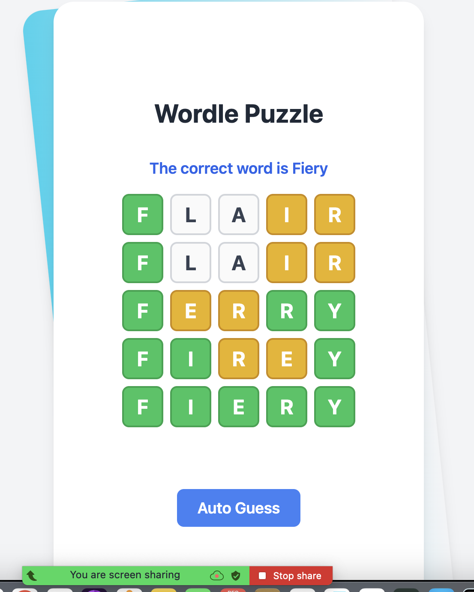
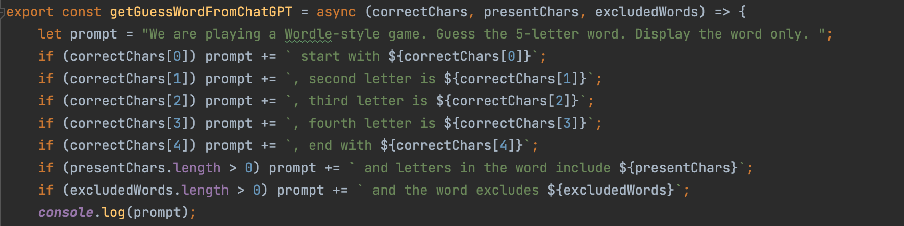

<!-- PROJECT LOGO -->
 

  

<h3 align="center">Wordle Puzzle Auto Guessing</h3>

  

    Auto guessing wordle puzzle game using ChatGPT
  

<!-- GETTING STARTED -->
## Introduction
This is assignment for Backend position but I think it would be better if we have a interactive game UI instead of plain console log.

### Description
* Developing auto guessing wordle game using ChatGPT
* Using prompt engineering to get the guessed words form OpenAI api and show them in the game. The current word return based on previous word characters.

### Techniques

* OpenAPI chatGPT prompt engineering
* React and tailwindCSS for game UI
* Auto design and generative FE code using Pure code AI

### Tech stack

* Programming Language: Javascript
* Framework: React, tailwind, openAI ChatGPT, pure code AI

### How to test
1. npm install
2. npm run start
